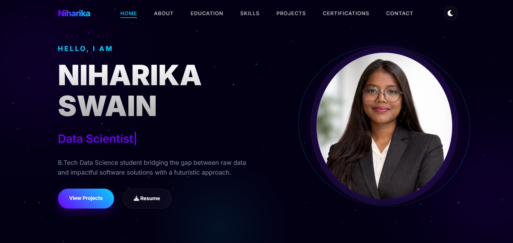

# 🚀 Modern Portfolio | Niharika Swain

<div align="center">

### ✨ A Modern Developer Portfolio ✨

Designed with glassmorphism, neon aesthetics, smooth animations, and responsive UI for a premium digital experience.

</div>

---

## 🌌 Preview



---

# ✨ About The Project

This is my personal portfolio website built to showcase my:

- 💻 Technical Skills
- 🚀 Projects
- 🎓 Education
- 📜 Certifications
- 📧 Contact Information

The portfolio combines modern UI/UX trends like:

- Glassmorphism
- Neon Glow Effects
- Animated Backgrounds
- Responsive Layouts
- Smooth Scrolling Animations

to create an immersive and professional web experience.

---

# 🔥 Features

## 🌙 Modern UI/UX
- Modern dark theme
- Neon gradient effects
- Interactive glowing elements

## 📱 Fully Responsive
- Mobile friendly
- Tablet optimized
- Desktop optimized

## ⚡ Interactive Effects
- Particle background
- Typing text animation
- Hover glow effects
- Scroll reveal animations

## 📧 Smart Contact Form
Integrated with Google Sheets using Google Apps Script for real-time message storage.

## 🎨 Theme Toggle
Switch between dark and light mode seamlessly.

---

# 🛠️ Tech Stack

| Technology | Usage |
|------------|-------|
| HTML5 | Website Structure |
| CSS3 | Styling & Animations |
| JavaScript | Functionality & Effects |
| Font Awesome | Icons |
| Google Fonts | Typography |
| Google Apps Script | Contact Form Backend |

---

# 📂 Folder Structure

```bash
📦 MyPortfolio
 ┣ 📄 index.html
 ┣ 📄 style.css
 ┣ 📄 script.js
 ┣ 📄 README.md
 ┣ 📁 assets
 ┃ ┣ 📷 portfolio-image.png
 ┃ ┣ 📷 certificates
 ┃ ┗ 📷 project-images
