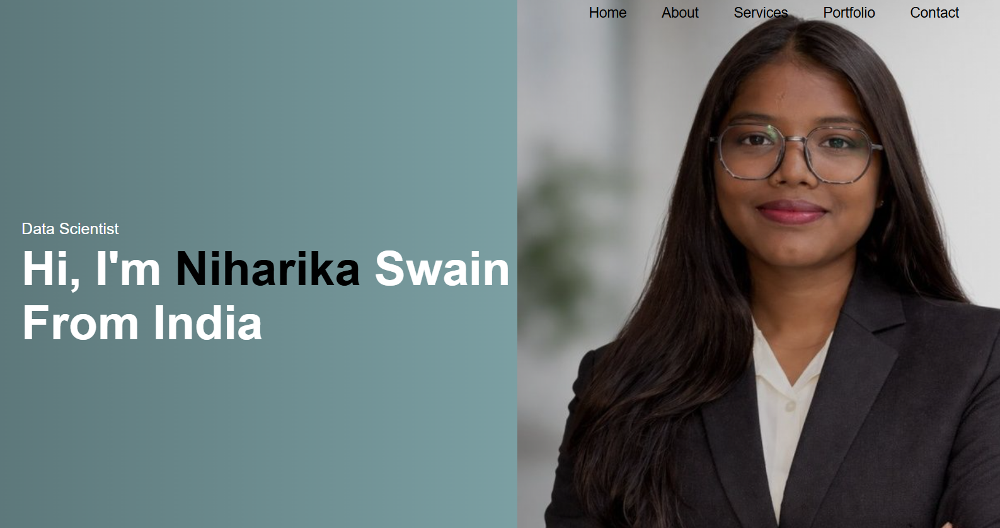

# ✨ Futuristic Portfolio – Niharika Swain

> A sleek, futuristic, and fully responsive personal portfolio crafted with modern web technologies, immersive animations, and glass-morphism aesthetics.



---

## 🌌 Overview

Welcome to my digital universe 🚀  
This portfolio represents my journey as a developer, showcasing my projects, technical skills, achievements, certifications, and passion for creating visually stunning and functional web experiences.

Designed with a futuristic UI/UX approach, this website combines elegant animations, neon-glow aesthetics, interactive effects, and smooth responsiveness to create a premium browsing experience.

---

## 🔥 Live Features

✨ **Glass-morphism UI Design**  
⚡ **Interactive Particle Background**  
🌙 **Dark / Light Theme Toggle**  
⌨️ **Dynamic Typing Animation**  
📱 **Fully Responsive Layout**  
🎯 **Scroll Reveal Animations**  
💫 **Mouse Glow Interaction**  
📧 **Google Sheets Integrated Contact Form**  
🚀 **Smooth Navigation & Modern UI**

---

## 🛠️ Tech Stack

### 💻 Frontend
- HTML5
- CSS3
- JavaScript (Vanilla)

### 🎨 UI & Styling
- Glass-morphism Design
- CSS Animations
- Flexbox & CSS Grid
- Responsive Media Queries

### 🌐 Integrations
- Google Apps Script
- Google Sheets API

### 🔗 Libraries & Resources
- Font Awesome
- Google Fonts

---

## 📂 Project Structure

```bash
📁 MyPortfolio
 ┣ 📄 index.html
 ┣ 📄 style.css
 ┣ 📄 script.js
 ┣ 📁 assets
 ┃ ┣ 📷 portfolio-image.png
 ┃ ┗ 📷 other-images
 ┗ 📄 README.md
